# Medica

Medica is a multi-tenant clinic management web application for doctors and assistants, with patient records, appointments, prescriptions, invitations, and operational dashboards.


## Overview

Medica helps clinics run daily operations in one system: onboarding teams, registering patients, scheduling visits, recording consultations, and sharing patient context between doctors.

<p align="center">
  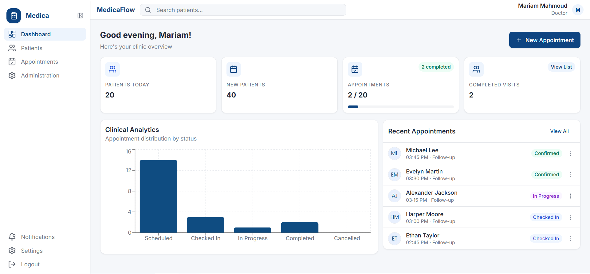
</p>

## Demo

- Live Frontend Demo: `https://frontend-neon-eta-yhbfdcoe8c.vercel.app/`
- Backend Health Check: `https://medica-be45.onrender.com/health`
- Demo Account: `<optional>`

## Documentation

- `docs/architecture.md`
- `docs/api.md`
- `docs/deployment.md`
- `docs/security.md`

## Repository Notes

- This is a portfolio/freelance showcase project.
- Real secrets are not committed.
- Environment variables are managed outside source control.

## Features

- Multi-tenant clinic onboarding (doctor creates clinic) and invitation-based assistant signup.
- JWT authentication with access and refresh tokens.
- Role-aware access control for doctor and assistant actions.
- Patient management with MRN generation and patient search.
- Appointment scheduling, status updates, and consultation flow.
- Medical records and linked prescriptions.
- Clinic-scoped medication suggestions from historical prescriptions.
- Notifications and dashboard summaries for day-to-day activity.

## Tech Stack

- Frontend: React 18, TypeScript, Vite, React Router, Zustand, Tailwind CSS.
- Backend: FastAPI, SQLAlchemy (async), Pydantic, python-jose, bcrypt.
- Database: PostgreSQL (production via Supabase pooler) or SQLite (local default).
- Deploy: Render (backend), Vercel (frontend).
- CI: GitHub Actions (backend tests + frontend type-check).

## Screenshots

### Dashboard

<p align="center">
  
</p>

### Authentication

<table>
  <tr>
    <td align="center">
      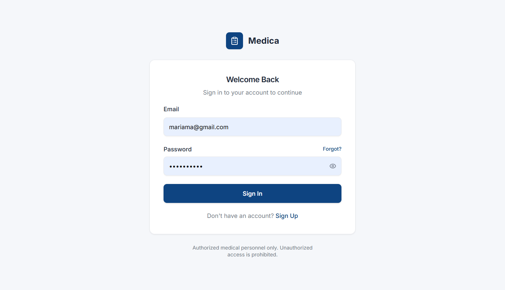<br />
      <sub><strong>Login</strong></sub>
    </td>
    <td align="center">
      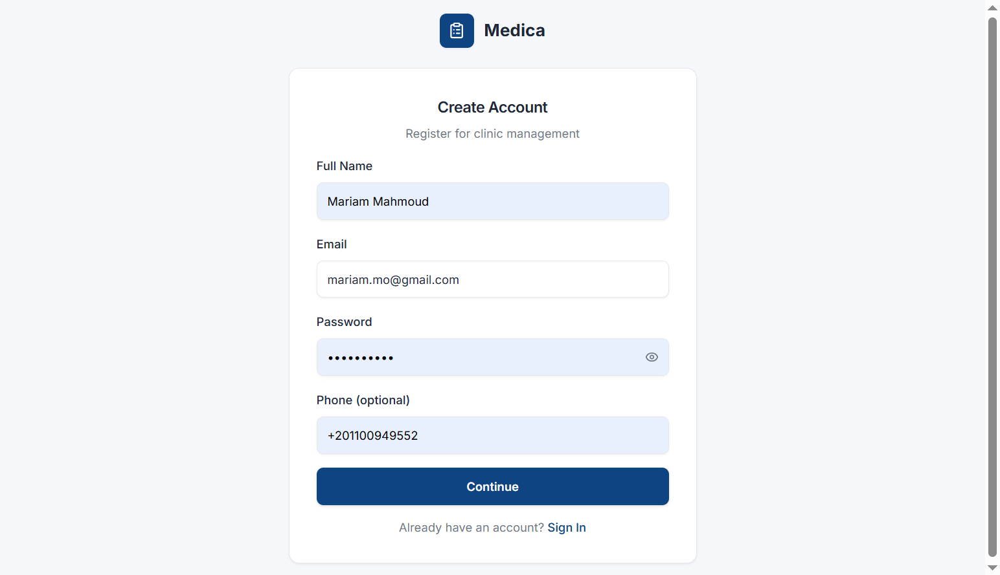<br />
      <sub><strong>Signup</strong></sub>
    </td>
    <td align="center">
      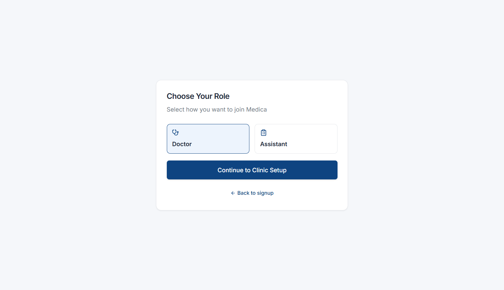<br />
      <sub><strong>Select Role</strong></sub>
    </td>
  </tr>
</table>

<p align="center">
  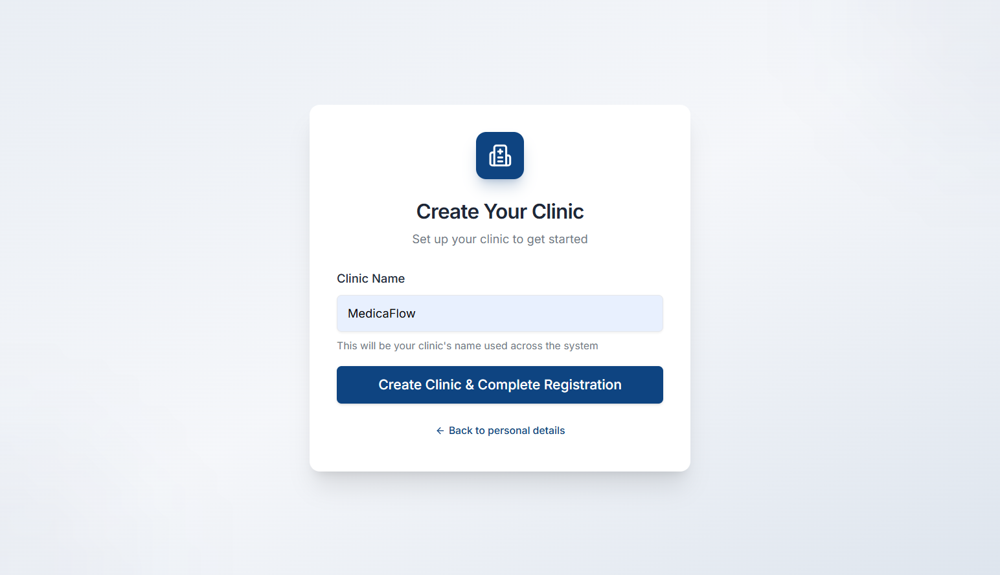<br />
  <sub><strong>Create Clinic</strong></sub>
</p>

### Patients Management

<table>
  <tr>
    <td align="center">
      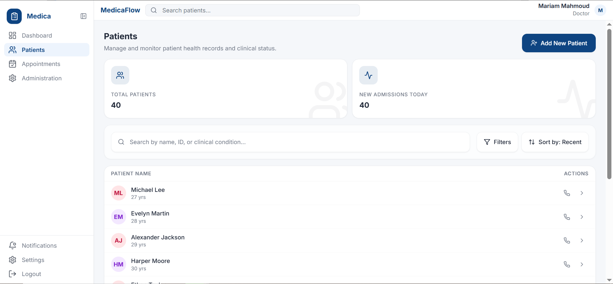<br />
      <sub><strong>Patients List</strong></sub>
    </td>
    <td align="center">
      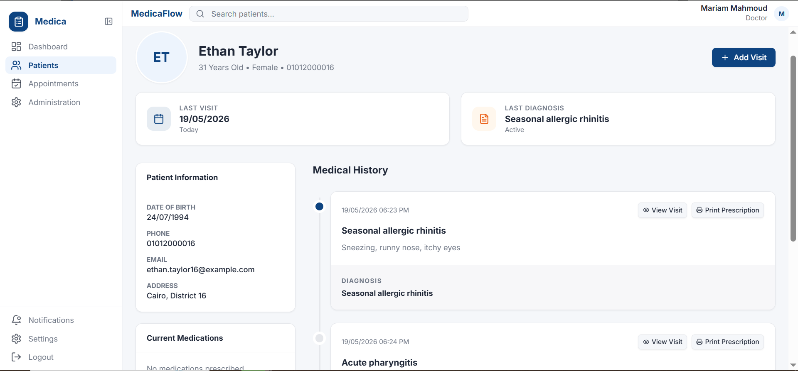<br />
      <sub><strong>Patient Profile</strong></sub>
    </td>
  </tr>
</table>

### Appointments

<p align="center">
  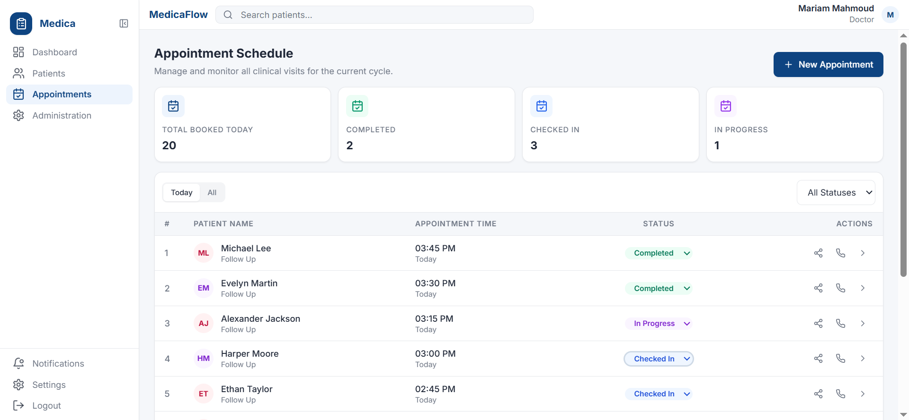<br />
  <sub><strong>Appointments Board</strong></sub>
</p>

### Consultations and Prescriptions

<p align="center">
  <br />
  <sub><strong>Visit Timeline, Consultation Notes, and Prescriptions</strong></sub>
</p>

### Collaboration and Administration

<p align="center">
  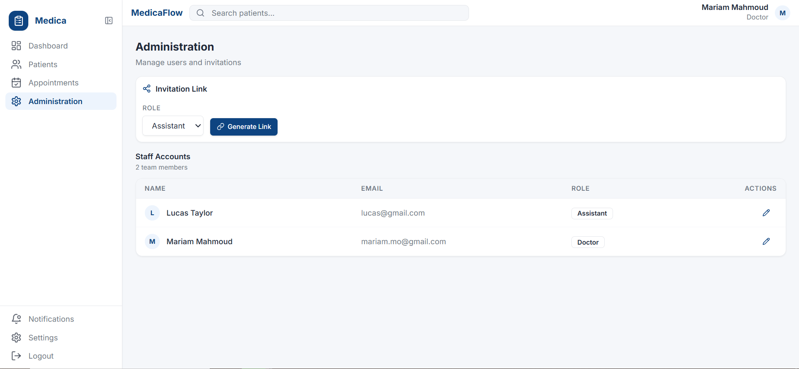<br />
  <sub><strong>Administration</strong></sub>
</p>

<table>
  <tr>
    <td align="center">
      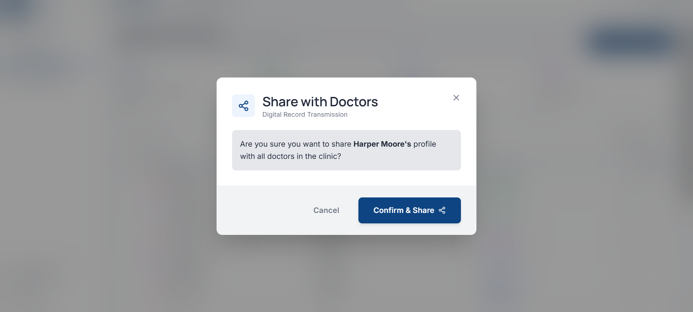<br />
      <sub><strong>Share Patient Flow</strong></sub>
    </td>
    <td align="center">
      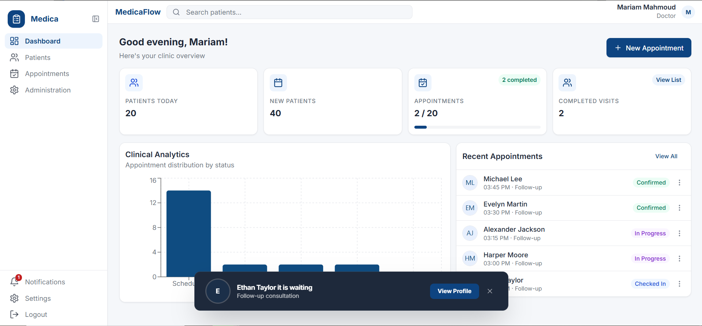<br />
      <sub><strong>Share Patient Flow - Step 2</strong></sub>
    </td>
  </tr>
</table>

## Architecture Overview

- **Frontend (React + TypeScript):** Single-page app for authentication, dashboard, patient lifecycle, and appointments.
- **Backend (FastAPI):** REST API under `/api/v1` with role checks and tenant-scoped access.
- **Database (PostgreSQL/SQLite):** SQLAlchemy models for tenants, users, patients, appointments, records, prescriptions, invitations, and notifications.
- **Authentication:** JWT access and refresh token flow.
- **Multi-tenant model:** each user belongs to a tenant, and domain queries are scoped by tenant context.

## Security Highlights

- JWT access/refresh token flow with role checks on protected routes.
- Tenant-scoped data access in API handlers.
- Rate limiting on sensitive endpoints (`register`, `login`, `refresh`, invitation checks).
- Global exception responses avoid leaking internal error details.
- Sensitive values are env-driven; `.env` files are git-ignored.

See `docs/security.md` for full details and Phase 2 recommendations.

## Deployment

- **Frontend:** Vercel
- **Backend:** Render
- **Configuration:** environment variables are managed outside source control (`backend/.env` locally, platform env settings in deployed environments).
- **API routing:** frontend rewrites `/api/*` to backend host (`frontend/vercel.json`).
- **Hardening status:** Phase 1 controls include rate limiting, tenant endpoint protection, and sanitized global error responses.


## Local Setup

### Prerequisites

- Node.js 20+ (22 used in CI)
- Python 3.12+ (3.13 used in CI)
- npm

### 1) Clone and install dependencies

```bash
git clone <your-repo-url>
cd Medica

# Backend
python -m venv .venv
# Windows PowerShell:
.venv\Scripts\Activate.ps1
pip install -r backend/requirements.txt
pip install pytest pytest-asyncio aiosqlite httpx greenlet

# Frontend
cd frontend
npm install
cd ..
```

### 2) Configure environment

Create `backend/.env` from `backend/.env.example`.

Required variables:

- `DATABASE_URL`
- `DATABASE_URL_SYNC`
- `SECRET_KEY`
- `RESEND_API_KEY`
- `FRONTEND_URL`

Use placeholders only. Never commit real secrets.

## Run the App

### Backend

```bash
cd backend
uvicorn app.main:app --host 0.0.0.0 --port 8000 --reload
```

Backend API base: `http://localhost:8000/api/v1`
Health endpoint: `http://localhost:8000/health`

### Frontend

```bash
cd frontend
npm run dev
```

Frontend app: `http://localhost:5173`

## Run Tests and Checks

### Backend tests

```bash
pytest backend/tests/test_endpoints.py -q
pytest backend/tests -v --tb=short
```

### Frontend type-check

```bash
cd frontend
npx tsc --noEmit
```

## Future Improvements

- Move auth tokens from `localStorage` to HttpOnly cookies.
- Add refresh-token revocation and session tracking.
- Add secure logout and CSRF protections for cookie-based auth.
- Expand auth integration tests for login/refresh/logout/session scenarios.
- Evaluate distributed rate limiting for horizontally scaled deployments.
